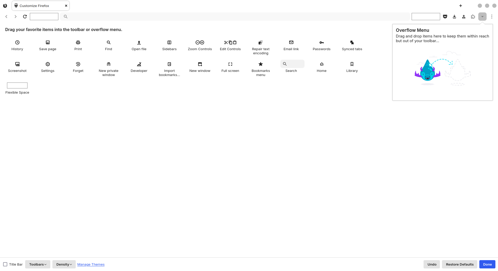
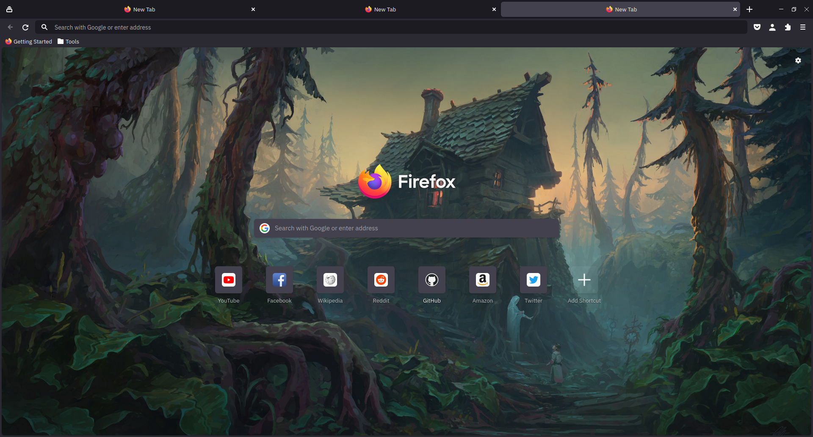
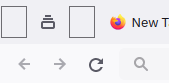

<h1 align="center">
	<br>
 Firefox Tela.Prototype Theme
</h1>

<p align="center"><strong>A simple theme for Firefox with slightly rounded edges, Tela icons and some tweaks.</strong></p>
<p align="center">This is a variation of the Kore theme, but uses Tela by vinceliuice icons instead of Papirus, as well as other small changes.</p>

## Light Theme


## Dark Theme with full width tabs


## Description

This is a Firefox theme that combines things I like and have found in other themes I've used.


## Installation

### Installation script

Clone this repo and enter folder and run script:

```sh
git clone https://github.com/Xuaolu/firefox-tela.prototype-theme.git && cd firefox-tela.prototype-theme
./scripts/install.sh
```

#### Install script

```sh
./scripts/install.sh # Standard
./scripts/install.sh -f ~/.var/app/org.mozilla.firefox/.mozilla/firefox # Flatpak
```

##### Script options

- `-f <firefox_folder_path>` *optional*
    - Set custom Firefox folder path, for example `~/.mozilla/icecat/`.
    - Default: `~/.mozilla/firefox/`

- `-p <profile_name>` *optional*
    - Set custom profile name, for example `e0j6yb0p.default-nightly`.
    - Default: All the profiles found in the firefox folder


#### Manual Installation
Create a chrome folder in your Firefox profile directory, place the `theme` folder, `userChrome.css` and `userContent.css` inside this folder. Place `user.js` inside your Firefox profile directory.

## Tweaks
To enable tweaks, navigate to `about:config` and create a boolean key for each tweak you want to use and set it to `true`.
To disable a tweak, set the key to `false` or delete it.
### Add padding and rounded corners around the browser window.
```
uc.tweak.rounded-corners
```
### Adds a custom background image to the new tab page.

#### Required setup:
* In your `chrome/firefox-tela.prototype-theme/theme/` folder, add an image with a filename of background-0.(jpg/png).
* Optionally, add a second image named background-1.(jpg/png) this will be selected when the dark theme is enabled.
```
uc.tweak.newtab-background
```

### Hide the Firefox logo + wordmark when on the new tab page.
```
uc.tweak.hide-newtab-logo
```

### Hide access keys in context menu.
```
uc.tweak.context-menu.hide-access-key
```

### Enable full width tabs.
```
uc.tweak.tabwidth
```


## Recomendation
I changed the size of the "Flexible Space" to correct the space between the new tab and the corner of the screen or some tool that goes here.




## Uninstalling

1. Go to your profile folder. (Go to `about:support` in Firefox > Application Basics > Profile Directory > Open Directory)
2. Remove `chrome` folder.


## Credits
**[Rafael Mardojai CM](https://github.com/rafaelmardojai/firefox-gnome-theme)** and [contributors](https://github.com/rafaelmardojai/firefox-gnome-theme/graphs/contributors). 

**[Sai Kurogetsu](https://github.com/kurogetsusai/firefox-gnome-theme)**

**[bmFtZQ](https://github.com/bmFtZQ/edge-frfox)**

**[datguypiko](https://github.com/datguypiko/Firefox-Mod-Blur)**
